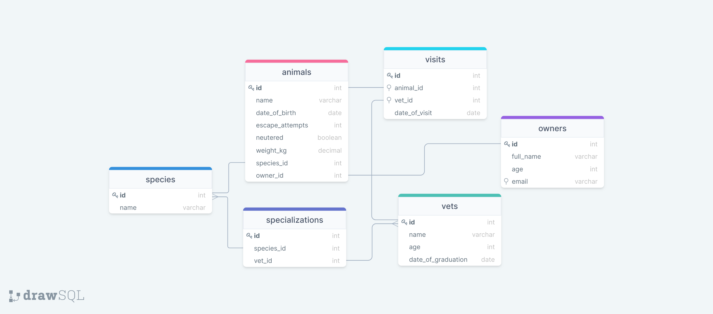

# Vet Clinic Database

> This is a vet clinic database project to grasp the concepts of databases and PostgreSQL.

## Getting Started

This repository includes files with plain SQL that can be used to recreate a database:

- Use [schema.sql](./schema.sql) to create all tables.
- Use [data.sql](./data.sql) to populate tables with sample data.
- Check [queries.sql](./queries.sql) for examples of queries that can be run on a newly created database. **Important note: this file might include queries that make changes in the database (e.g., remove records). Use them responsibly!**

## Authors

👤 **Pedro Guerreiro**

- GitHub: [@guerreiropedr0](https://github.com/guerreiropedr0)
- Twitter: [@guerreiropedr0](https://twitter.com/guerreiropedr0)
- LinkedIn: [Pedro Guerreiro](https://www.linkedin.com/in/guerreiropedr0/)

## 🤝 Contributing

Contributions, issues, and feature requests are welcome!

Feel free to check the [issues page](../../issues/).

## Show your support

Give a ⭐️ if you like this project!

## Acknowledgments

- [FreeCodeCamp's Youtube video tutorial of PostgreSQL](https://www.youtube.com/watch?v=qw--VYLpxG4)

## 📝 License

This project is [MIT](./MIT.md) licensed.
